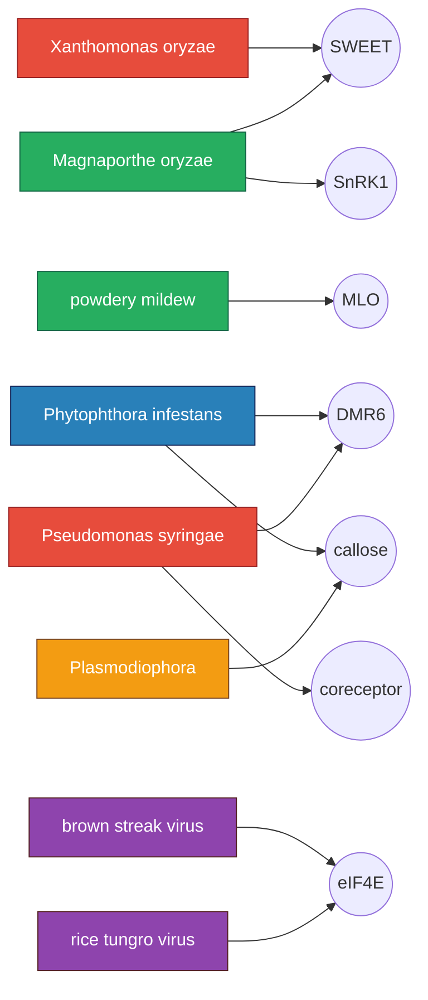

# funcgenomic

A small atlas and ranker for crop pathogen host dependency factors.

The question it tries to answer: across major crop pathogens, which host genes and pathways do many of them rely on, and which of those look most worth defending first.

## What is in here

- `data/host_targets.csv` curated atlas, 14 rows across rice, wheat, tomato, potato, cassava, brassica, banana, maize. One row per crop x pathogen x host target.
- `data/effector_host_edges.csv` companion table of pathogen effectors and the host modules they engage.
- `src/funcgenomic/scoring.py` five axis ranking rule. Evidence, breadth across pathogen classes, edit tractability, deployability, fitness risk. Weights live in `configs/weights.toml`.
- `src/funcgenomic/atlas.py` rolls per row scores up to host process level.
- `src/funcgenomic/novelty.py` flags host modules that are engaged by structurally different effectors from very different pathogen classes.
- `notebooks/walkthrough.ipynb` short notebook tour with plots.
- `docs/` concept, plan, validation, schema, sources, architecture.

## Network at a glance



## Running it

No external dependencies for the core code. Python 3.10 or newer.

```bash
PYTHONPATH=src python3 -m funcgenomic rank --top 10
PYTHONPATH=src python3 -m funcgenomic processes --top 8
PYTHONPATH=src python3 -m funcgenomic novelty
```

Tests:

```bash
PYTHONPATH=src python3 -m unittest discover -s tests
```

For the notebook: `pip install matplotlib numpy jupyter` then open `notebooks/walkthrough.ipynb`.

## Sample output

```
host process                         breadth  evidence novelty  score  bar
SWEET sucrose efflux                       3      4.80       1   3.89  ####################
DMR6 salicylate hub                        3      4.00       1   3.37  #################
eIF4E translation initiation               3      4.30       0   3.28  #################
MLO susceptibility                         2      4.50       0   3.19  ################
phospholipid metabolism                    2      4.40       0   3.04  ################
callose deposition                         2      3.90       0   3.03  ################
coreceptor immune signalling               3      3.70       1   3.01  ###############
SnRK1 metabolic gate                       2      4.10       0   2.92  ###############
```

## Repo layout

```
funcgenomic/
├── README.md
├── docs/
├── data/
├── src/funcgenomic/
├── tests/
├── notebooks/
├── configs/weights.toml
└── pyproject.toml
```
