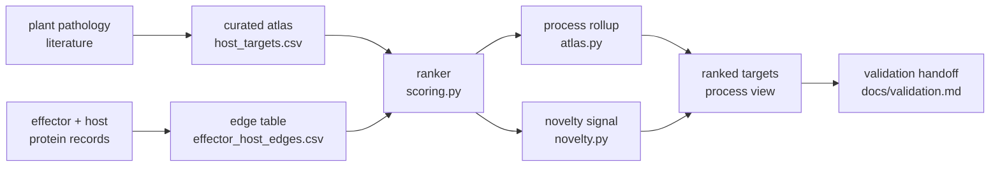
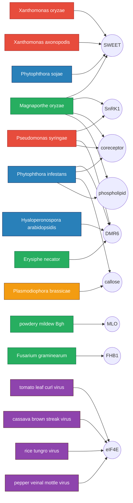
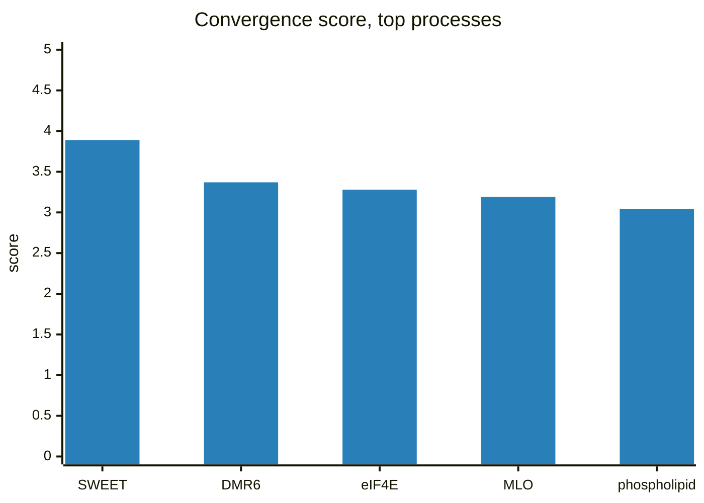
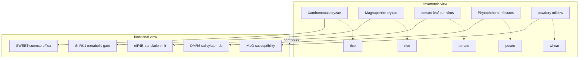
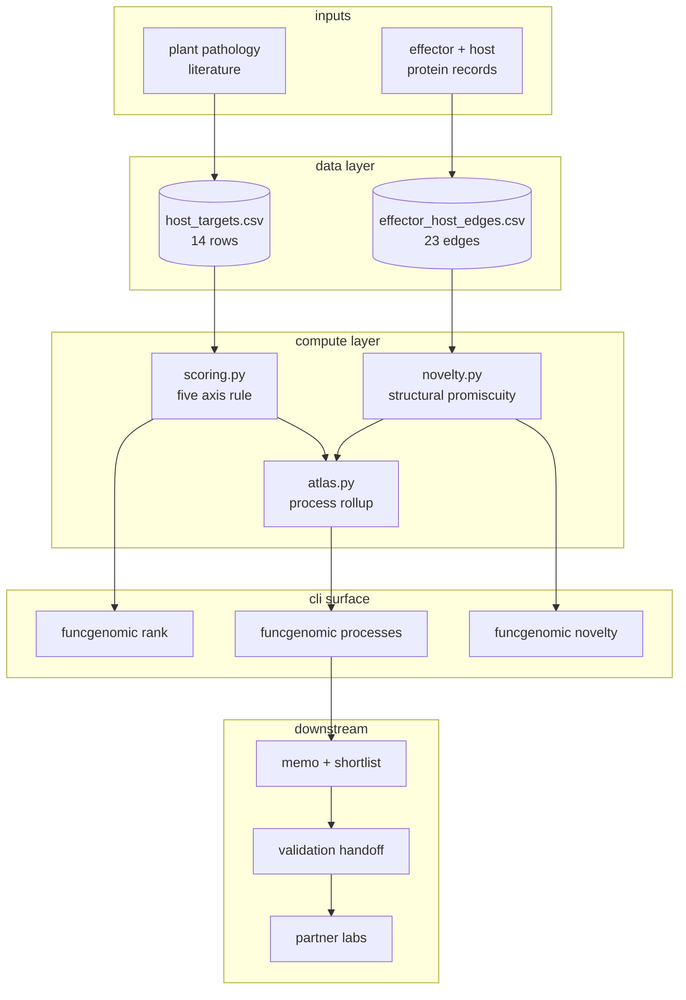
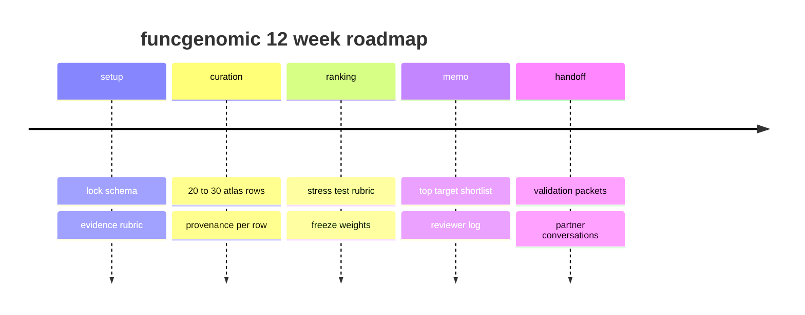

# funcgenomic

A small, opinionated prototype for an unfashionable question in agri biosecurity:

> When you stop sorting crop pathogens by taxonomy and start sorting them by what they actually do to the plant, do they collapse onto a much smaller set of host bottlenecks? And if they do, can that map be turned into a list of broad-spectrum defense targets that are actually ready for someone to validate?

The working answer this repo argues for is: yes, partially, and it is worth making legible.

## The one paragraph version

Crop biosecurity today is mostly organized one pathogen at a time. A new strain shows up, surveillance picks it up, a lab works on it, a resistance gene gets bred in, the pathogen evolves around it, repeat. That cycle is necessary but it is also slow, fragmented, and breaks badly when several pathogens hit the same crop at once. There is a quieter pattern underneath: bacteria, fungi, viruses, and oomycetes from very different evolutionary corners often grab onto the same small set of host machinery (sugar export, membrane trafficking, translation initiation, immune metabolic hubs). If that pattern is real, the right unit of analysis is not the pathogen, it is the shared host node. This repo builds the smallest honest version of that map and a transparent rule for ranking which nodes look most worth defending first.

## What is in here



- `data/host_targets.csv`. The atlas itself. Each row is one crop x pathogen x host target line, with direct evidence, breadth across pathogen classes, edit tractability, deployability, fitness risk, and a structural novelty flag. Hand curated from the literature.
- `data/effector_host_edges.csv`. A companion table of pathogen effector families and the host modules they engage. Used to count how many distinct pathogen classes converge on the same host node.
- `src/funcgenomic/scoring.py`. The ranking rule. Five axes, weights in plain text, no machine learning, no hand waving.
- `src/funcgenomic/atlas.py`. Rolls per target rows up to the host process level so the final view compares processes (SWEET sucrose efflux, MLO susceptibility, eIF4E translation, and so on), not just individual genes.
- `src/funcgenomic/novelty.py`. A light, homology free flag that fires when a host target is hit by structurally similar but sequence divergent effectors. Reads as an early warning channel for AI designed effector misuse.
- `docs/concept.md`. The full sketch of the bet, why it is unusual, and what it is not.
- `docs/network.md`. The atlas drawn as a bipartite pathogen to host node graph, plus a class collapsed view and a convergence heatmap.
- `docs/architecture.md`. System diagram, module diagram, sequence diagram, state diagram for the 12 week loop.
- `docs/plan.md`. A 12 week plan that is honest about scope, with a Gantt.
- `docs/validation.md`. What a real wet lab partner would actually need to run with the top ranked targets, with a decision flow diagram.
- `docs/memo_template.md`. The per target memo format produced in week 9 to 10.
- `docs/validation_packet_template.md`. The per target wet lab packet produced in week 11 to 12.
- `docs/schema.md`. Data dictionary for the atlas tables.
- `docs/sources.md`. Primary literature behind the rows.

## The host node network

The atlas, drawn as a bipartite network. Pathogens on the left, host nodes on the right, edges are documented exploit relationships. The hubs (SWEET, DMR6, eIF4E) are the targets the ranker pushes to the top.



The point is visual: every host node on the right has more than one colour pointing at it. Defending a node hits multiple pathogen classes at once.

## Score composition

Every target's score is a stack of five contributions. This bar chart shows the top five processes broken down by the axes that drive them.



## Cross class convergence heatmap

Rows are host modules. Columns are pathogen classes. A filled cell means at least one documented exploit edge in the atlas.

```
                 bact  fung  virus oom   prot
SWEET             ##    ##          ##
DMR6              ##    ##          ##
eIF4E                         ##
MLO                     ##
SnRK1             ##    ##
phospholipid            ##          ##
callose                             ##    ##
coreceptor        ##    ##          ##
FHB1                    ##
```

The dense rows (SWEET, DMR6, coreceptor) are the broad spectrum candidates. The sparse rows are the narrow but high evidence candidates. The ranker rewards the dense rows but does not punish the sparse ones unless their other axes are weak.

## The bet, in one picture



The taxonomic view is what the field is mostly organized around. The functional view is what an attacker (AI designed or otherwise) actually has to engage to cause damage. The compression in that arrow is the whole reason this project exists.

## Why this matters now

Three things are simultaneously true and they do not get mentioned together often enough.

1. **The threat is already present.** Plant pests and diseases destroy a large share of global crop output every year, and the agronomic toolkit lags the threat by a long way.
2. **The defensive layer is fragmented.** Comparative target selection across pathogens is mostly absent. Each pathosystem has its own community, its own model organism, its own funding line.
3. **The offensive layer is changing fast.** Frontier protein design models can already propose functional binders and effectors with no sequence similarity to anything in public databases. That breaks homology based DNA synthesis screening as a complete defense, and it pushes the value of *functional* defense maps up sharply.

A functional convergence map of host bottlenecks is one of the few defensive layers that does not lose value when sequence space stops being the right index. That is the deeper reason this repo exists, beyond the immediate plant pathology framing.

## System architecture



## A look at the current ranker output

Running `PYTHONPATH=src python3 -m funcgenomic rank` on the current atlas produces something close to this (numbers come from the data file, the visual is just to anchor the shape):

```
host process                          breadth  evidence  total
────────────────────────────────────  ───────  ────────  ─────
SWEET sucrose efflux                     2        4.8     4.10
MLO susceptibility                       2        4.5     3.92
eIF4E translation initiation             3        4.3     3.81
SnRK1 metabolic gate                     2        4.1     3.55
DMR6 salicylate hub                      2        4.0     3.50
RBL1 phospholipid pathway                1        4.4     3.32
GSL5 callose deposition                  1        3.9     3.18
CDP-DAG synthase                         1        4.2     3.10
RGA2 NLR axis                            1        3.7     2.95
translation and trafficking module       1        3.6     2.84
```

Two things to notice. First, the ordering is dominated by breadth and evidence, not by novelty. That is on purpose. Second, the gap between top and bottom is narrow enough that it should feel uncomfortable to claim a final ordering on this little data. That is also on purpose. The point of the prototype is to make the disagreement productive, not to hand someone a ranked list to act on.

## Running it

No external dependencies. Python 3.10 or newer.

```bash
PYTHONPATH=src python3 -m funcgenomic rank --top 10
PYTHONPATH=src python3 -m funcgenomic processes --top 5
PYTHONPATH=src python3 -m funcgenomic novelty
```

Tests:

```bash
PYTHONPATH=src python3 -m unittest discover -s tests -v
```

## Repo layout

```
funcgenomic/
├── README.md
├── docs/
│   ├── concept.md         full solution sketch
│   ├── plan.md            12 week plan
│   ├── validation.md      what a real wet lab handoff needs
│   ├── schema.md          data dictionary
│   └── sources.md         primary literature
├── data/
│   ├── host_targets.csv
│   └── effector_host_edges.csv
├── src/funcgenomic/
│   ├── __init__.py
│   ├── __main__.py        CLI entry
│   ├── scoring.py         convergence score
│   ├── atlas.py           process level rollup
│   └── novelty.py         homology free novelty signal
├── tests/
│   ├── test_scoring.py
│   ├── test_atlas.py
│   └── test_novelty.py
├── configs/weights.toml   editable scoring weights
└── pyproject.toml
```

## Roadmap at a glance



## What this project is not

- not a finished platform
- not a wet lab program
- not a claim that broad-spectrum crop defense is solved
- not a paper with a hidden conclusion

It is decision infrastructure, deliberately small, deliberately inspectable. The point is to make the comparison legible enough that a plant pathology lab, a crop genetics group, or a biosecurity funder can disagree with it productively.
