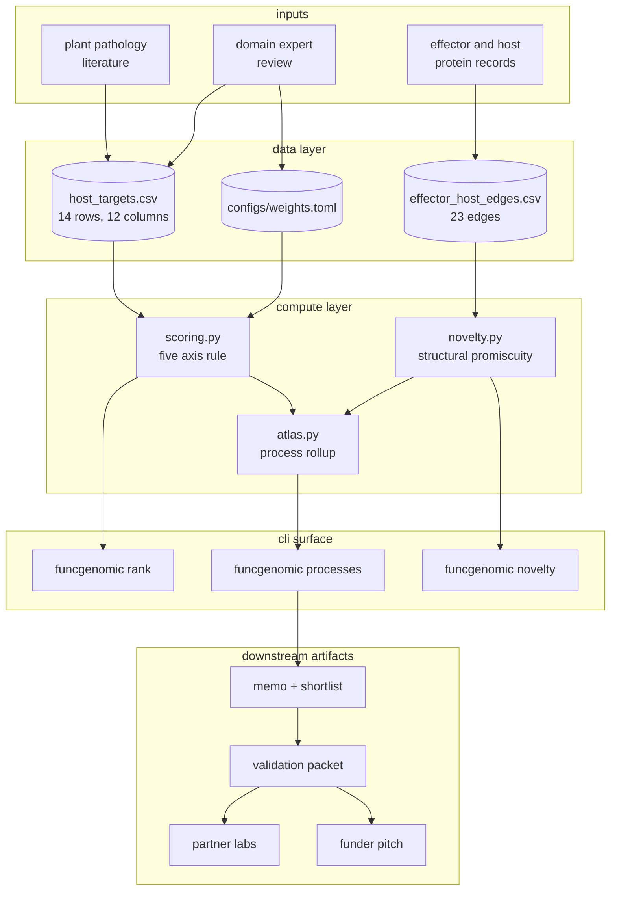
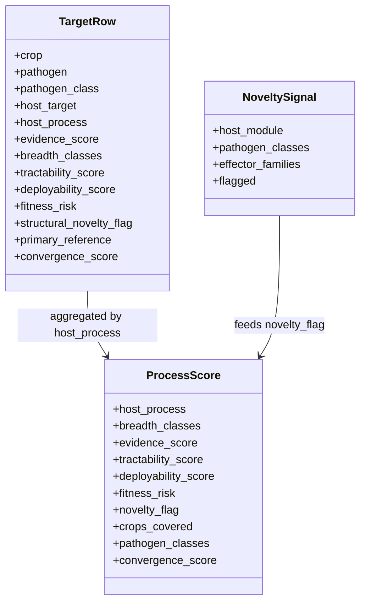
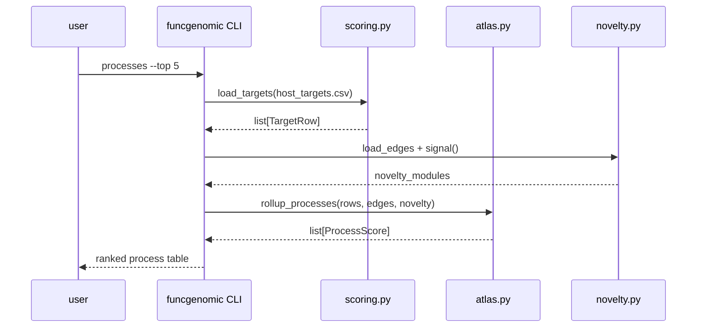
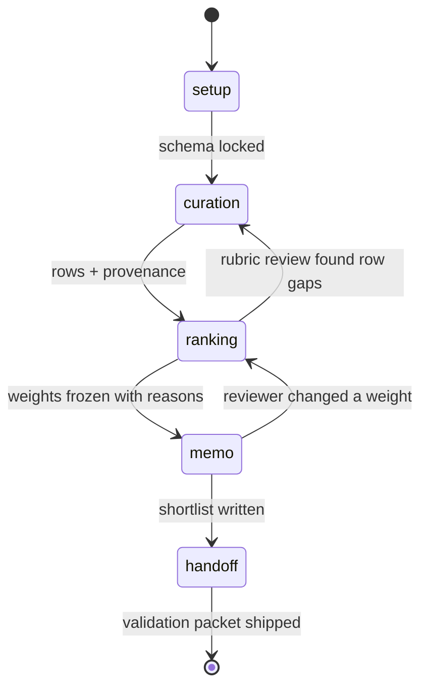

# Architecture

## System view

## Module view

## Data flow on a single query

## State across the 12 weeks

The two reverse arrows are the part that matters. Curation, ranking, and memo phases all loop back when a domain reviewer finds something. The artifact gets better when the curator and the reviewer disagree productively.
