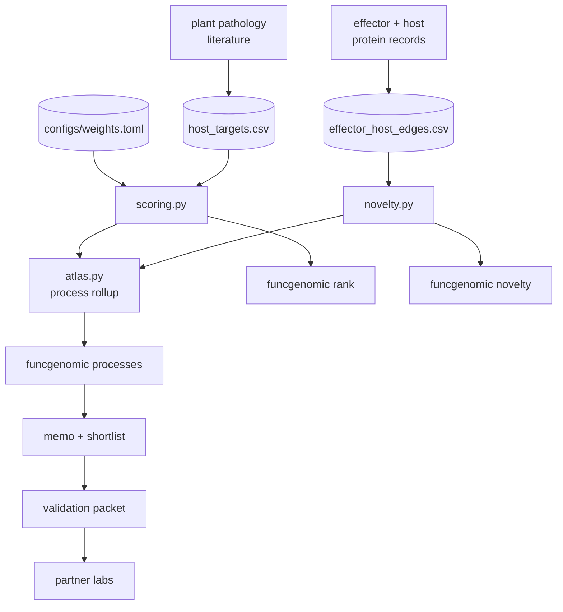

# Architecture

Inputs on top, data layer in CSVs, three small Python modules in the middle, three CLI commands on the surface, and a memo plus validation packet at the end. That is the whole system.
