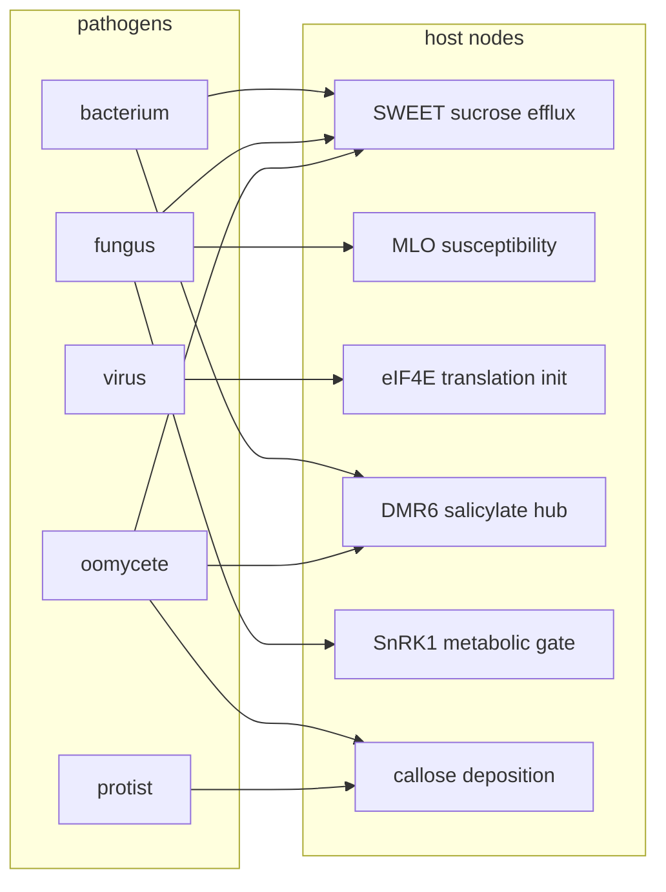
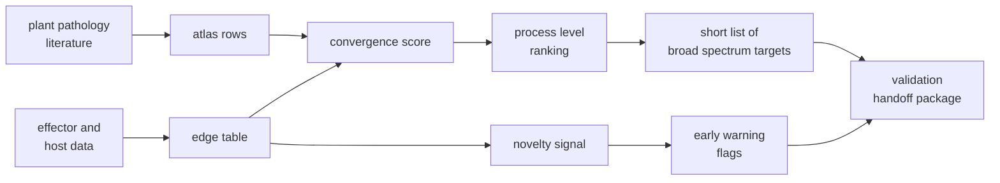

# Concept

## The bet

Crop pathogens look infinitely diverse if you sort them by taxonomy. They look surprisingly small if you sort them by what they actually do once they are inside the plant. Bacteria, fungi, viruses, and oomycetes from very different evolutionary corners keep grabbing onto the same short list of host machinery. Sucrose export, membrane trafficking, translation initiation, salicylate signalling, callose deposition, a few metabolic gates. This is the bet that funcgenomic is built on. If the convergence is real, then the right unit of analysis for crop biosecurity is not the pathogen but the host node.

## A simple picture

The diagram is not exhaustive. It is the shape of the claim. A small number of host nodes pick up edges from a lot of different pathogen classes. If you defend the node, you defend against many pathogens at once.

## Why now and why this is not just plant pathology

There is a second reason this matters in 2026 that does not get said often enough in plant biology rooms.

Frontier protein design models can already propose functional binders, toxins, and effectors that have no sequence similarity to anything in public databases. The line of defense that has done a lot of the heavy lifting for biosecurity, namely homology based DNA synthesis screening, is built on sequence similarity. A novel sequence with the same function slips through.

But the host side does not change. A novel effector still has to engage one of the same host nodes to do damage. If we have already mapped which host nodes the world's pathogens converge on, we have a defense layer that does not lose value when sequence space stops being a useful index. That is what makes a functional convergence map a biosecurity object and not just a plant pathology object.

## What the project actually produces

Three things by the end of twelve weeks.

1. A small but honest atlas. Maybe 20 to 30 rows. Each row carries a primary reference and an evidence rating.
2. A ranking that is opinionated, transparent, and easy to argue with.
3. A validation handoff package for the top three to five host processes. Assay sketches, candidate edits, partner labs that already run those assays, what a yes or no answer would look like.

What the project does not produce. A finished platform. A wet lab program. A claim that the ordering is correct. A paper.

## Why a transparent rule and not a model

Two reasons.

First, there is not enough labeled data. A serious model would need a held out set of host targets with known broad spectrum effects measured under field conditions, and that set is small enough today that a model trained on it would be memorising. A transparent five axis rule does the same job without pretending to know things it does not.

Second, the value of this artifact is in the disagreement it causes. A plant pathology lab that sees the ranking should be able to point at the rule, point at the weight that is wrong for their system, and propose a different one. That is much harder if the ranking comes out of a learned model. Decision infrastructure for an early field needs to invite argument.

## The structural novelty signal in plain words

This is the smallest, most speculative part of the project. The idea is that if a host module is already known to be engaged by structurally similar effectors from very different pathogens (for example DMR6 hit by RxLRs from oomycetes, by CSEPs from fungi, and by coronatine from bacteria), then that module is a structural attractor. It is exactly where novel AI designed effectors are most likely to land too. The novelty signal flags those modules so that the validation pipeline puts a little extra weight on them.

This is not a prediction system. It is a tag that says: this module shows up in the literature in a structurally promiscuous way and you should defend it earlier rather than later.

## Honest limits

- The atlas is small. The rule is simple. The novelty signal is not a model.
- Several rows lean on a single primary paper.
- Ranking output is not actionable on its own. It is an input to a conversation with a wet lab partner.
- Some host targets that look great on the ranking will turn out to have unacceptable yield costs in the field. The fitness risk axis tries to capture this but the data behind it is sparse.

The project is a sketch with code. It is meant to make a messy problem more legible, not to declare it solved.
