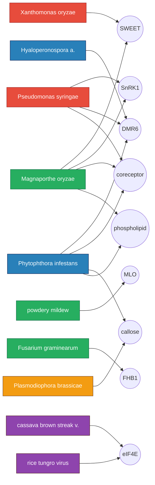

# Host node network

The atlas as a bipartite graph. Pathogens on the left coloured by class. Host modules on the right. Edges are documented exploit relationships.



## Cross class convergence

```
                 bact  fung  virus oom   prot   classes
SWEET             X     X           X            3
DMR6              X     X           X            3
coreceptor        X     X           X            3
SnRK1             X     X                        2
phospholipid            X           X            2
callose                             X     X      2
MLO                     X                        1
FHB1                    X                        1
eIF4E                         X                  1
```

`>= 3` is the structural novelty zone. Those are the modules engaged by very different effectors and the most useful to defend ahead of time.
