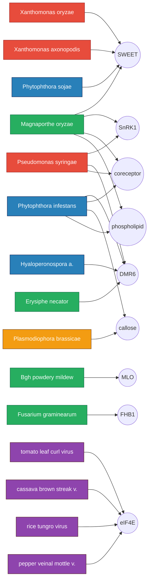
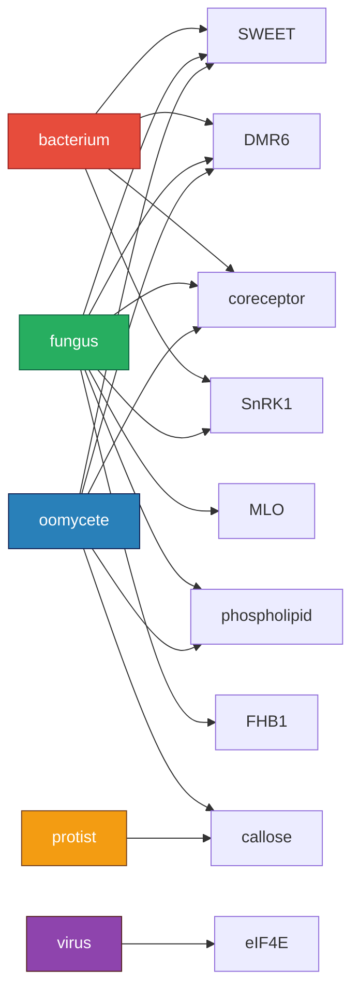

# The host node network

The atlas is a small bipartite graph. One set of nodes is pathogens. The other set is host modules. Edges are documented exploit relationships from the literature. Defending an exploited host node breaks all the edges going into it at once. The whole project is a way of turning that picture into a ranked list.

## Pathogens to host nodes



## The same network, collapsed to classes and modules

What it looks like once you stop caring about which species and only care about which class.



## Convergence heatmap

A coarse heatmap of which classes are documented to engage which host module in the atlas plus edges file.

```
                 bact  fung  virus oom   prot   sum
SWEET             X     X           X            3
DMR6              X     X           X            3
coreceptor        X     X           X            3
SnRK1             X     X                        2
phospholipid            X           X            2
callose                             X     X      2
MLO                     X                        1
FHB1                    X                        1
eIF4E                         X                  1
```

`sum >= 3` is the structural novelty zone. Those are the modules that show up in the literature as functionally promiscuous attractors and are the most useful to defend ahead of time.

## Reading the network

Three things to notice that the score table alone does not show:

1. **Hubs are sparse.** Most pathogens hit one or two modules in the atlas. Three modules (SWEET, DMR6, coreceptor) catch many. That is the convergence pattern.
2. **Class diversity matters more than edge count.** SWEET has more edges than DMR6 in absolute terms, but DMR6 reaches three classes too. Both are broad spectrum candidates. The ranker treats them as comparable.
3. **eIF4E is tall and narrow.** It looks like a hub but it only collects virus edges. Still very valuable, but the right framing is `viral broad spectrum` not `kingdom broad spectrum`.
