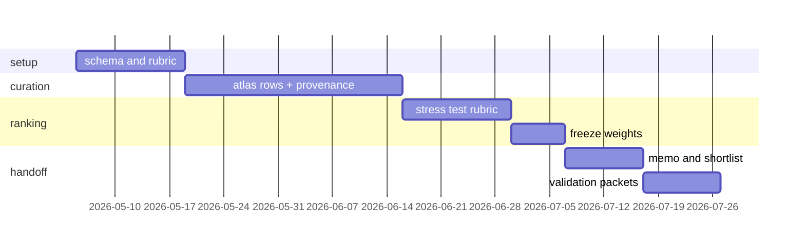

# 12 week plan

## Setup (weeks 1 to 2)
- Lock crops: rice, wheat, tomato, potato, cassava, brassica.
- Freeze the schema. Decide what counts as strong evidence.

## Curation (weeks 3 to 5)
- 20 to 30 atlas rows. Per row primary citation. Direct vs inferred evidence flagged.

## Ranking (weeks 6 to 8)
- Two domain reviewers. Capture every weight change with a written reason.

## Memo (weeks 9 to 10)
- Short opinionated memo on the top candidates. Name the gaps.

## Handoff (weeks 11 to 12)
- For top three to five processes: assay sketches, candidate edits, partner labs, go/no-go conditions.

## What done looks like
- Repo someone can clone, run, and get a ranked list out of in two minutes.
- Memo a wet lab partner can read in fifteen minutes and disagree with usefully.
- Validation packets a PI could actually take and run with.
