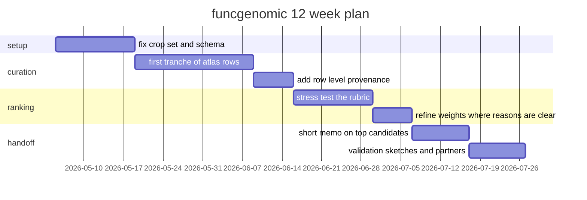

# Twelve week plan

The plan is intentionally narrow. The point is to ship a small, inspectable artifact, not to build a finished platform.

## Weeks 1 and 2 (setup)

- Lock the initial crop set: rice, wheat, tomato, potato, cassava, brassica.
- Standardize the schema. Decide what counts as strong enough evidence to enter the table.
- Decide ahead of time which fields are scores and which are flags. Avoid score creep.

Output: a frozen schema and a one page evidence rubric.

## Weeks 3, 4, 5 (curation)

- Curate the first tranche of host targets. Aim for around 20 to 30 rows.
- Add citation level provenance per row.
- Separate direct evidence (a published edit produced a measured resistance phenotype) from inferred evidence (mechanism implies a target).

Output: `data/host_targets.csv` populated, each row backed by at least one primary reference.

## Weeks 6, 7, 8 (ranking)

- Stress test the rubric. Pick three pairs of obvious high value targets versus awkward but realistic counterexamples and check that the ordering is defensible in both directions.
- Sit with two domain reviewers. Capture every disagreement as either a weight change or a row level note.
- Resist refining weights without a written reason. Drift is the enemy.

Output: `configs/weights.toml` with comments explaining each axis weight, plus a short reviewer log.

## Weeks 9 and 10 (memo)

- Write a short, opinionated memo on the most plausible targets for follow up.
- Be explicit about where the table is still too sparse to support strong claims. List those holes by name.

Output: `docs/memo.md` (will be added during this phase).

## Weeks 11 and 12 (handoff)

- For the top three to five host processes, produce a validation sketch: assay choices, candidate edit (CRISPR or base edit), control conditions, what a positive and negative result would actually look like.
- Map two or three plant pathology labs per target who already run the assay.
- Cost assumptions for a minimum viable validation, even if rough.

Output: `docs/validation_handoff/` with one file per top target.

## What done looks like

- A repo a stranger can clone, run, and get a ranked list out of in under two minutes.
- A memo a wet lab partner can read in fifteen minutes and disagree with productively.
- A validation sketch for the top targets that someone could actually take to a PI.

## What done does not look like

- A wet lab pilot.
- A finished platform with a UI.
- A claim that the top of the ranking is the right answer.
