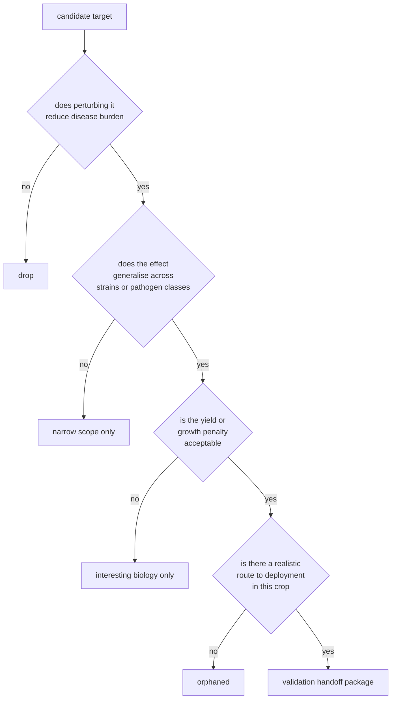

# Validation handoff

The hardest part of this project is not generating a plausible target list. It is producing a list that survives contact with agronomy. The ranking is upstream of validation. Validation is where the real cost lives.

## Four questions every candidate has to clear

Most plausible looking targets fail one of the inner questions. The ranker can rank well and still produce a list where two thirds of the rows drop out at question 2 or 3.

## Minimum viable validation per target

For each target on the short list:

- a relevant infection assay in an established model system
- effect size measurement, not just present or absent
- a parallel growth and fitness readout, so the disease answer does not hide the yield answer
- some attempt to separate `interesting mechanism` from `field plausible intervention`

The goal of the handoff is to make this small package easy to start, not to design the full study.

## What the partner needs from us

- the row level evidence behind the ranking, not just the final score
- the assumptions behind each weight in the rubric
- the failure modes the curator is worried about (these are usually the most useful part of the conversation)
- a list of candidate edits at the locus with at least one fallback if the first is hard to make

## Partner types worth approaching first

- plant pathology labs that already run infection assays in the relevant model
- crop genetics groups with established CRISPR or base editing pipelines in the target crop
- public sector breeding programmes with regulatory experience for edited crops in the target geography
- a small number of biosecurity oriented funders who care about cross pathogen defense

The right first conversation is rarely the most senior person. It is the postdoc who already has the assay running.

## What a no looks like

A clean negative is more valuable than a noisy positive. The handoff has to make it easy to say `we tried, it did not work, here is what we learned`. That includes:

- writing down failure modes ahead of time
- pre committing to what would change the ranking and how
- making the data and weights available so others can rerun the comparison without us
