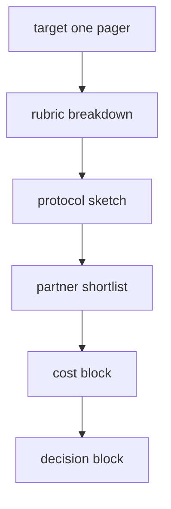
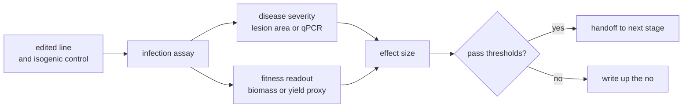

# Validation packet template

Goal: a short, self contained packet a wet lab partner can read in under fifteen minutes and use to decide whether they want to run the experiment. One per top ranked target. Filled in during weeks 11 and 12.

## Packet structure



## 1. Target one pager

```
crop            : ____
host process    : ____
specific genes  : ____
pathogens       : ____
why us          : 2 sentences max
status today    : not validated, partial, validated narrow
```

## 2. Rubric breakdown

Same five axis breakdown as the memo, plus the row level provenance from the atlas. Cite the primary reference inline.

## 3. Protocol sketch



Required fields:

- model system and isolate
- edit type (knockout, base edit, cis element edit, allele swap)
- positive and negative controls
- replicates and statistical power assumption
- pre committed pass and fail thresholds (numbers, not adjectives)

## 4. Partner shortlist

Two or three labs ranked by fit. For each:

- group lead, postdoc or grad student likely to run the assay
- existing pipelines that overlap the protocol
- relationship status (cold, warm, in flight)
- ask we are making (run, advise, co lead)

## 5. Cost block

```
edit construction         : USD ~
plant transformation      : USD ~
infection assay           : USD ~ per replicate, ~ replicates
plant growth and space    : USD ~
analysis                  : USD ~
slack                     : USD ~
                          ------
total                     : USD ~
```

Rough ranges only. The point is to make the order of magnitude visible, not to pretend to a quote.

## 6. Decision block

```
go condition       : ____ (specific, measurable)
no go condition    : ____ (specific, measurable)
```

If neither block is fillable, the packet is not done.

## 7. What this packet is not

- not a grant
- not a contract
- not a publication plan

It is a sketch a wet lab partner can react to in fifteen minutes.
